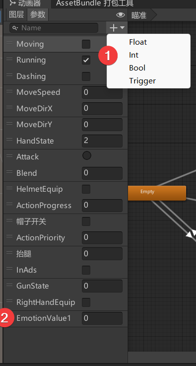
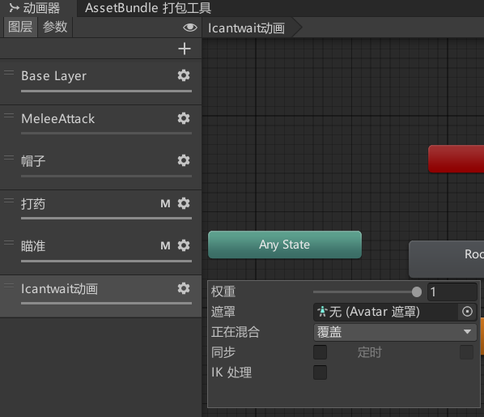
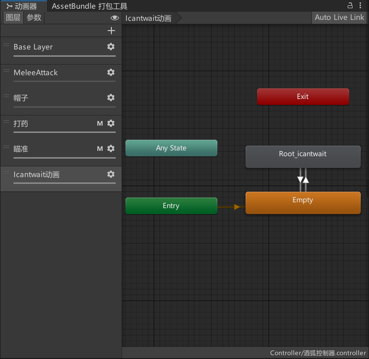
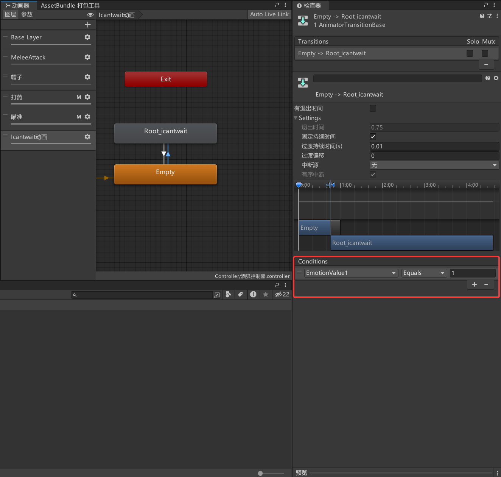
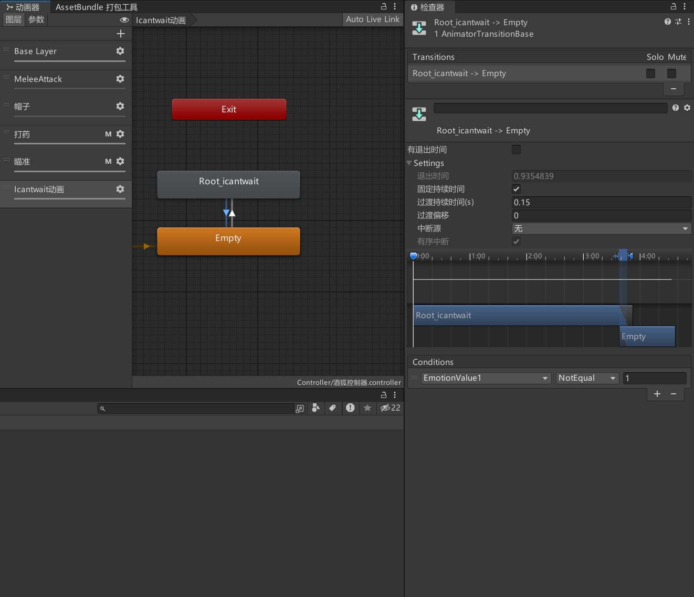

# 添加自定义按键表情动画

1. 打开动画器，点击参数菜单，添加`int`类型的`EmotionValue1`或者`EmotionValue2`参数

   

2. 点击图层菜单，新建一个图层，并且把权重拉到1。

   

3. 在图层内添加一个空动画和一个想要播放的动画。

   

4. 添加条件`EmotionValue1`等于0-7的某个值，对应F1-F8。建议留出`F1`用于还原默认动画。

   

   

5. 完成添加。